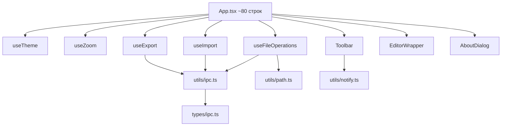
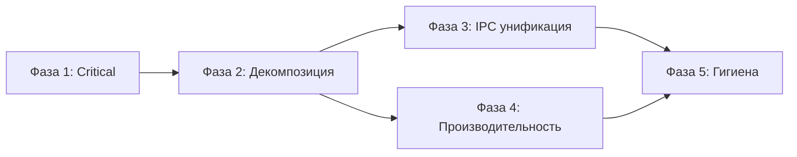

# План рефакторинга GravityMD

**Основание:** [`AUDIT-REPORT.md`](../AUDIT-REPORT.md) — 41 находка (2 Critical, 23 Warning, 16 Info)  
**Цель:** повысить Code Cleanliness с 5.2 → 8.0+, Architecture Unification с 3.8 → 7.0+  
**Принцип:** каждая фаза — независимый набор изменений, который можно реализовать и верифицировать отдельно

---

## Фаза 1: Критические исправления

> 2 находки Critical. Не затрагивает архитектуру, минимальный риск регрессии.

### 1.1 Включить CSP в `tauri.conf.json`

| Что | Файл | Изменение |
|-----|------|-----------|
| Заменить `"csp": null` на минимальную политику | [`tauri.conf.json`](../src-tauri/tauri.conf.json:23) | `"csp": "default-src 'self'; script-src 'self'; style-src 'self' 'unsafe-inline'; img-src 'self' data: blob:; font-src 'self' data:;"` |

**Обоснование:** `"csp": null` полностью отключает Content Security Policy — любой JavaScript может быть инжектирован через загрузку ресурсов с внешних доменов. Для десктоп-приложения с доступом к файловой системе это критическая уязвимость.

**Риск:** `unsafe-inline` для стилей необходим для Gravity UI (inline-стили компонентов). Если после включения CSP часть UI ломается — проверить консоль на CSP-violations и добавить нужные директивы.

### 1.2 Переписать Rust-команды на async I/O

| Что | Файл | Изменение |
|-----|------|-----------|
| Добавить `tokio` в зависимости | [`Cargo.toml`](../src-tauri/Cargo.toml) | `tokio = { version = "1", features = ["fs"] }` |
| Переписать `read_file_content` | [`lib.rs`](../src-tauri/src/lib.rs:12-14) | `async fn read_file_content(path: String) -> Result<String, String> { tokio::fs::read_to_string(&path).await.map_err(\|e\| e.to_string()) }` |
| Переписать `write_file_content` | [`lib.rs`](../src-tauri/src/lib.rs:17-19) | `async fn write_file_content(path: String, content: String) -> Result<(), String> { tokio::fs::write(&path, content).await.map_err(\|e\| e.to_string()) }` |
| Переписать `write_file_binary` | [`lib.rs`](../src-tauri/src/lib.rs:22-26) | `async fn write_file_binary(path: String, data: String) -> Result<(), String> { use base64::Engine; let bytes = base64::engine::general_purpose::STANDARD.decode(&data).map_err(\|e\| e.to_string())?; tokio::fs::write(&path, bytes).await.map_err(\|e\| e.to_string()) }` |
| Заменить `.lock().ok().and_then()` | [`lib.rs`](../src-tauri/src/lib.rs:8) | `.lock().expect("InitialFile mutex poisoned")` |

**Обоснование:** синхронный `std::fs` в Tauri-командах блокирует общий поток приложения. При чтении файлов >1MB интерфейс зависает.

**Риск:** минимальный — `tokio::fs` API идентичен `std::fs`. Tauri 2.x автоматически обрабатывает `async fn` команды.

---

## Фаза 2: Декомпозиция App.tsx

> Главная архитектурная проблема: монолитный компонент 621 строка. Цель — разбить на модули без изменения поведения.

### Целевая структура файлов

```
src/
├── App.tsx                    # ~80 строк: компоновка компонентов
├── App.scss                   # без изменений
├── solarized-light.scss       # без изменений
├── styles.scss                # без изменений
├── main.tsx                   # без изменений
├── ErrorBoundary.tsx          # без изменений
├── components/
│   ├── EditorWrapper.tsx      # ~130 строк: редактор + paste-плагин
│   ├── Toolbar.tsx            # ~80 строк: кнопки + зум
│   └── AboutDialog.tsx        # ~30 строк: диалог About
├── hooks/
│   ├── useFileOperations.ts   # ~100 строк: open/save/saveAs/loadContent
│   ├── useTheme.ts            # ~30 строк: тема + persist
│   ├── useZoom.ts             # ~15 строк: зум + persist
│   ├── useImport.ts           # ~60 строк: import DOCX/XLSX
│   └── useExport.ts           # ~120 строк: export DOCX + parseInline
├── utils/
│   ├── ipc.ts                 # ~40 строк: safeReadTextFile, safeWriteTextFile, safeWriteBinaryFile
│   ├── path.ts                # ~10 строк: getFileName, SUPPORTED_EXTENSIONS
│   └── notify.ts              # ~10 строк: notify helper
└── types/
    └── ipc.ts                 # ~20 строк: типы IPC-команд и ответов
```

### 2.1 Создать `utils/path.ts`

- `getFileName(path: string): string` — извлечение имени файла (заменяет 3 дублирования `path.split(/[\\/]/).pop()`)
- `SUPPORTED_EXTENSIONS = ['md', 'txt', 'markdown']` — единая константа
- `isSupportedFile(path: string): boolean` — проверка расширения

### 2.2 Создать `utils/notify.ts`

- `notify(title: string, theme: 'success' | 'danger' | 'warning')` — обёртка над `toaster.add` с автогенерацией `name`

### 2.3 Создать `utils/ipc.ts`

- `safeReadTextFile(path: string): Promise<string>` — сначала `readTextFile`, при ошибке — `invoke('read_file_content')`
- `safeWriteTextFile(path: string, content: string): Promise<void>` — сначала `writeTextFile`, при ошибке с проверкой типа — `invoke('write_file_content')`
- `safeWriteBinaryFile(path: string, data: Uint8Array): Promise<void>` — сначала `writeFile`, при ошибке — base64 + `invoke('write_file_binary')`

**Ключевое отличие от текущего кода:** fallback только для ошибок `PermissionDenied`. Остальные ошибки пробрасываются.

### 2.4 Создать `types/ipc.ts`

- Интерфейсы: `IpcReadFileParams`, `IpcWriteFileParams`, `IpcWriteBinaryParams`
- Типизированные обёртки: `invokeReadFileContent`, `invokeWriteFileContent`, `invokeWriteFileBinary`, `invokeGetInitialFile`

### 2.5 Выделить `hooks/useTheme.ts`

- `useTheme()` — инкапсулирует `theme`, `loadTheme`, `saveTheme`, `toggleTheme`, `gravityTheme`
- Persist через `plugin-store`

### 2.6 Выделить `hooks/useZoom.ts`

- `useZoom()` — инкапсулирует `zoom`, `setZoom`
- **Добавить persist** через `plugin-store` (сохранение зума между сессиями)

### 2.7 Выделить `hooks/useFileOperations.ts`

- `useFileOperations()` — инкапсулирует `currentFile`, `content`, `currentValue`, `fileKey`, `dirty`
- Методы: `handleOpenFile`, `handleOpen`, `handleSave`, `handleSaveAs`, `loadContent`
- Использует `safeReadTextFile` / `safeWriteTextFile` из `utils/ipc.ts`
- Использует `getFileName` / `isSupportedFile` из `utils/path.ts`

### 2.8 Выделить `hooks/useImport.ts`

- `useImport(currentValue, currentFile, loadContent)` — инкапсулирует `handleImportDocx`, `handleImportXlsx`
- Добавить валидацию пустого результата для DOCX

### 2.9 Выделить `hooks/useExport.ts`

- `useExport(currentValue)` — инкапсулирует `handleExportDocx` и `parseInline`
- Использует `safeWriteBinaryFile` из `utils/ipc.ts`

### 2.10 Выделить `components/EditorWrapper.tsx`

- Перенести из `App.tsx` компонент `EditorWrapper` с расширениями `LatexExtension`, `Mermaid`, paste-плагином
- Добавить `interface EditorWrapperProps` для типизации

### 2.11 Выделить `components/Toolbar.tsx`

- Перенести JSX тулбара из `App.tsx`
- Props: обработчики кнопок, `dirty`, `zoom`, `theme`

### 2.12 Выделить `components/AboutDialog.tsx`

- Перенести диалог About из `App.tsx`

### 2.13 Обновить `App.tsx`

- Импортировать хуки и компоненты
- Собрать всё в единую компоновку (~80 строк)



---

## Фаза 3: Унификация IPC и файловых операций

> Устранение дублирования и формализация стратегии файлового I/O.

### 3.1 Единая стратегия чтения/записи файлов

Все файловые операции в хуках идут через `utils/ipc.ts`:

```
Чтение:  readTextFile (plugin-fs) → fallback invoke (только PermissionDenied)
Запись:  writeTextFile (plugin-fs) → fallback invoke (только PermissionDenied)
Бинарная: writeFile (plugin-fs) → fallback invoke + base64 (только PermissionDenied)
```

**Удалить** прямые вызовы `readTextFile` / `writeTextFile` / `writeFile` из хуков — они вызываются только внутри `utils/ipc.ts`.

### 3.2 Унифицировать валидацию расширений

- `SUPPORTED_EXTENSIONS` из `utils/path.ts` используется:
  - В `handleOpenFile` — `isSupportedFile(path)`
  - В диалоге `open()` — `filters: [{ name: 'Markdown', extensions: SUPPORTED_EXTENSIONS }]`
- **Устраняет баг:** `.markdown` отсутствовал в диалоге `open()`

### 3.3 Структурированные ошибки в Rust

- Определить `enum AppError` с `#[derive(Serialize)]`:
  ```rust
  enum AppError { FileNotFound, PermissionDenied, InvalidPath, IoError }
  ```
- Команды возвращают `Result<T, AppError>` вместо `Result<T, String>`
- TypeScript-сторона: тип `AppError` в `types/ipc.ts` с обработкой по коду ошибки

### 3.4 Валидация путей в Rust

- Добавить `PathBuf::from(&path)` внутри команд
- Проверка расширения в `read_file_content` (defense-in-depth)
- Проверка на path traversal (`..` в пути)

---

## Фаза 4: Производительность редактора

> Устранение утечек памяти и оптимизация рендеринга.

### 4.1 Cleanup в `useEffect` EditorWrapper

```typescript
useEffect(() => {
  const handler = () => onSave(editor.getValue());
  editor.on('change', handler);
  return () => editor.off('change', handler);  // cleanup
}, [editor, onSave]);
```

### 4.2 Debounce для `editor.on('change')`

- Добавить debounce 300мс в `EditorWrapper`:
  ```typescript
  const debouncedSave = useMemo(() => debounce(onSave, 300), [onSave]);
  editor.on('change', () => debouncedSave(editor.getValue()));
  ```

### 4.3 Замена `key={fileKey}` на `editor.setValue()`

- Убрать `fileKey` из состояния
- В `EditorWrapper` добавить `useEffect` на изменение `initialContent`:
  ```typescript
  useEffect(() => {
    if (editor.getValue() !== initialContent) {
      editor.setValue(initialContent);
    }
  }, [initialContent, editor]);
  ```
- Это избегает полного ремаунта ProseMirror/CodeMirror при смене файла

### 4.4 Web Worker для импорта/экспорта (опционально)

- Вынести `mammoth.convertToHtml` и `XLSX.read` в Web Worker
- Вынести `parseInline` + цикл парсинга DOCX-экспорта в Web Worker
- **Приоритет:** низкий — для текущих размеров файлов (<1MB) блокировка UI минимальна

---

## Фаза 5: Гигиена кода и типизация

> Очистка зависимостей, мелкие улучшения.

### 5.1 Очистка `package.json`

| Действие | Пакет | Причина |
|----------|-------|---------|
| Удалить из `dependencies` | `vite-plugin-commonjs` | Не используется в `vite.config.ts` |
| Переместить в `devDependencies` | `@types/markdown-it` | Типы не нужны в продакшн-бандле |
| Удалить из `devDependencies` | `@types/html-to-docx` | `html-to-docx` не используется |
| Проверить и удалить | `buffer` | Проверить использование `Buffer` в коде; если нет — удалить |

### 5.2 `useMemo` для `gravityTheme`

- Обернуть `gravityTheme` в `useMemo` в `useTheme`

### 5.3 ErrorBoundary: убрать хардкод стилей

- Заменить inline-стили на CSS-класс с переменными темы

### 5.4 Persist зума через `plugin-store`

- В `useZoom` — сохранять/загружать значение зума через `plugin-store` (как тема)

### 5.5 Production-логирование в Rust

- Инициализировать `tauri-plugin-log` с уровнем `Warn` в release-режиме:
  ```rust
  let level = if cfg!(debug_assertions) { log::LevelFilter::Info } else { log::LevelFilter::Warn };
  ```

### 5.6 Ограничение `fs` permissions в `capabilities/default.json`

- Заменить `{ "path": "**" }` на более ограниченный scope (например, `$HOME/**`, `$DOCUMENTS/**`)
- Или добавить валидацию путей в Rust-командах (Фаза 3.4)

---

## Порядок выполнения и зависимости



- **Фаза 1** — независима, выполняется первой
- **Фаза 2** — зависит от Фазы 1 (async I/O используется в `utils/ipc.ts`)
- **Фазы 3 и 4** — могут выполняться параллельно после Фазы 2
- **Фаза 5** — завершающая, после всех архитектурных изменений

---

## Что НЕ входит в план

| Исключение | Причина |
|------------|---------|
| Мультиоконность | Не реализована в текущей кодовой базе — отдельный проект |
| Миграция с `xlsx` на ESM-библиотеку | `xlsx` v0.18 не поддерживает tree-shaking; миграция — отдельная задача с тестированием |
| Web Worker для импорта/экспорта | Опционально, приоритет низкий для текущих размеров файлов |
| React Compiler | Требует настройки babel/swc plugin — отдельная задача |
| Интеграция `@tauri-apps/plugin-log` на фронтенде | Улучшение, но не блокирует рефакторинг |
